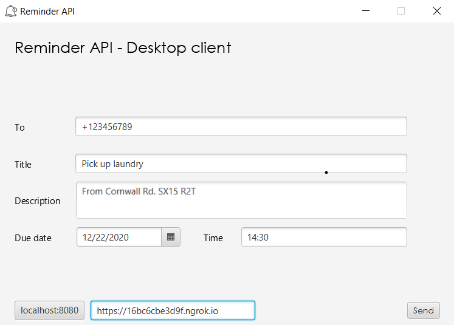
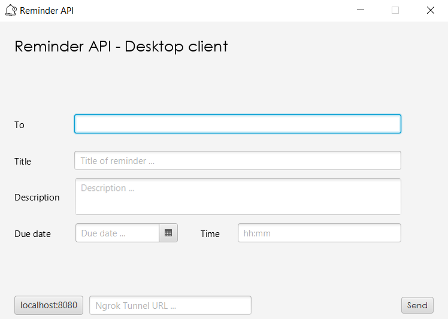
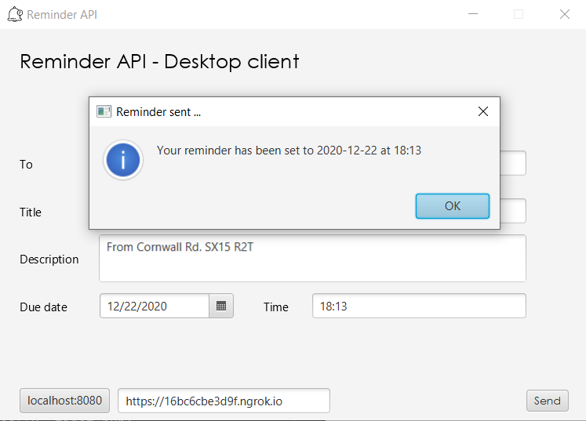

# Reminder API Client

Desktop client for [Reminder API](https://github.com/Horiapavel98/reminder-api-pub)

# Depends on

* [Reminder API](https://github.com/Horiapavel98/reminder-api-pub) - Horia Pavel

# Running Locally

To start this application locally, you need to add javafx as a library to your project.
You can check out information on how to do that [here](https://openjfx.io/openjfx-docs/)

### Running with Maven arguments

This project uses Maven for build automation. Once JavaFX is configured, run:
   
    mvn clean javafx:compile javafx:run

If you want to create the jar and then run it locally, first run:

    mvn clean package

After running this, you need to craft the following command:

    java --module-path <path-to-javafx-lib> --add-modules javafx.controls,javafx.graphics,javafx.fxml -jar .\target\reminder-api-client-1.0-SNAPSHOT.jar

Keeping in mind that after running `mvn clean package`, the jar created resides
in the `target` folder. JavaFx `lib` path needs to be set in the invocation command, 
and the modules required by the application added. After this the application
will start and can be interacted with normally as a detached process.

### Short intro

Here is an image of the main window of the application. The 'To' field is where
the phone number of the receiver is written; followed by the 'title' of the reminder
and then the description. The date and time are selected in the corresponding fields.

The `localhost` switch button supports direct connection with [Reminder API](https://github.com/Horiapavel98/reminder-api-pub)
running on the same computer and makes development work easier. If the button
is switched off as in the image, the `ngrok` URL field is enabled so the developer
or user can use the tunnel to remotely communicate with Reminder API.

If the `localhost` button is switched on, then the reminders are going to be sent
to the developers/users device that is now running the Reminder API service.

Upon completion of all the fields in the appropriate manner, clicking 'Send'
will show a confirmation dialog box to inform the user that the reminder has been
set.

### Notes

The design of this application aims to be light and easy to use while at the same
time providing an intuitive and efficient way of sending reminders fast.

@Horiapavel98
